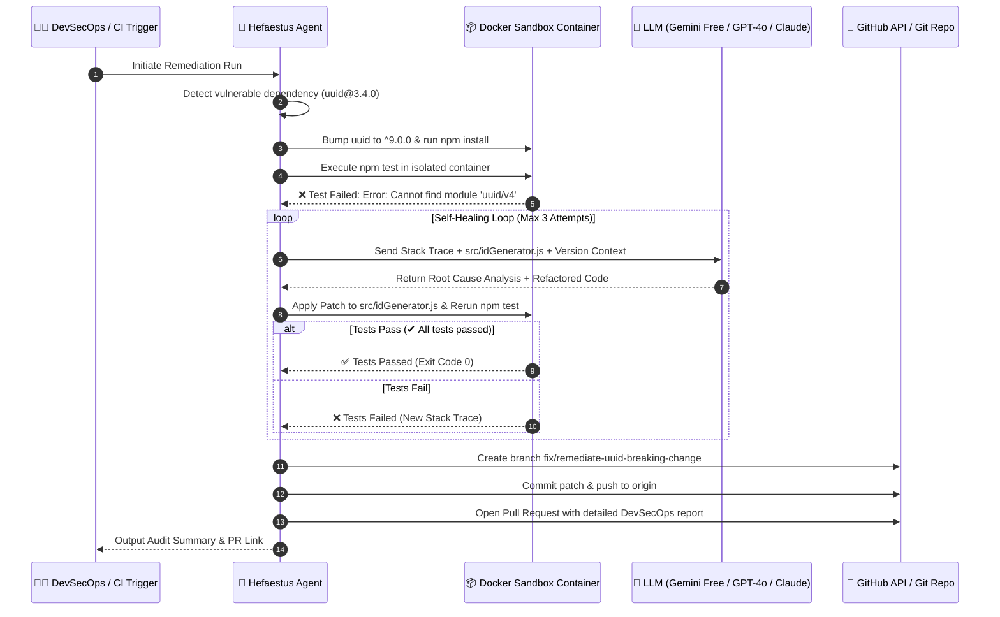

# 🔥 HEFAESTUS: Autonomous Dependency Remediation Agent
> **A Self-Healing DevSecOps Pipeline for Breaking Dependency Bumps & Vulnerability Remediation**

[](https://www.typescriptlang.org/)
[](https://nodejs.org/)
[](https://www.docker.com/)
[](https://aistudio.google.com/)
[](#)

---

## 📌 Executive Summary

Traditional Software Composition Analysis (SCA) tools (like Dependabot, Renovate, Snyk) excel at **detecting** vulnerabilities and bumping version numbers in `package.json`. However, when security patches introduce **deliberate breaking changes** (such as major semver updates, removed submodule imports, or altered method signatures), standard tools fail:

- `npm test` breaks with stack traces.
- Automated PRs stall or break CI pipelines.
- Security and platform teams face remediation fatigue, delaying critical CVE fixes.

**Hefaestus** bridges this gap. It is an **autonomous remediation agent** that not only upgrades the vulnerable dependency, but also captures the containerized test failure, invokes an LLM (**Google Gemini Free Tier**, **OpenAI GPT-4o**, or **Claude 3.5 Sonnet**) with call-site context, applies an automated AST/code patch, re-verifies in an isolated sandbox, commits the fix, and opens an audit-ready Pull Request.

---

## 🆓 Free API Access via Google Gemini (Google AI Studio)

You can run live LLM remediations with **100% free API calls** using Google Gemini:

1. Visit [Google AI Studio](https://aistudio.google.com/).
2. Click **Get API key** (no credit card required).
3. Add it to your `.env`:
   ```env
   LLM_PROVIDER=gemini
   GEMINI_API_KEY=your_gemini_api_key_here
   GEMINI_MODEL=gemini-2.0-flash
   ```
4. **Free Tier Limits for `gemini-2.0-flash`:**
   - **15 Requests / Minute (RPM)**
   - **1,000,000 Tokens / Minute (TPM)**
   - **1,500 Requests / Day (RPD)**

*(OpenAI GPT-4o and Anthropic Claude 3.5 Sonnet are also supported, alongside an offline Deterministic Engine).*

---

## 🏗️ Architecture & Workflow



---

## 📂 Project Structure

```text
hephaestus-poc/
├── docker-compose.yml       # Orchestrates agent and isolated test sandbox
├── .env.example             # Configuration template (Gemini, OpenAI, Anthropic, GitHub)
├── package.json             # Root workspace convenience commands
├── README.md                # Documentation & 2-minute live demo guide
├── agent/                   # Autonomous Orchestrator Service
│   ├── Dockerfile           # Alpine container with Node.js 20, Docker CLI & Git
│   ├── package.json         # Agent dependencies (@google/genai, @octokit, openai, anthropic)
│   ├── tsconfig.json        # TypeScript configuration
│   └── src/
│       ├── index.ts         # CLI entry point orchestrating the 5-step lifecycle
│       ├── git.ts           # Git branch, commit, diff, and Octokit PR creation
│       ├── runner.ts        # Executes npm test inside Docker sandbox or local runtime
│       └── llm.ts           # Multi-provider client (Gemini Free, GPT-4o, Claude 3.5, Demo Engine)
├── mock-target-app/         # Vulnerable target repository for live demonstration
│   ├── package.json         # Uses vulnerable uuid@3.4.0 (breaks on uuid@^9.0.0)
│   ├── src/
│   │   └── idGenerator.js   # Uses deprecated require('uuid/v4')
│   └── test/
│       └── idGenerator.test.js # Test suite asserting generated ID
└── scripts/
    └── reset-demo.js        # Script to instantly reset mock-target-app for repeat demos
```

---

## ⚡ 2-Minute Live Demo Walkthrough

### Option A: Local Run (Fastest - 30 Seconds)

1. **Install agent dependencies:**
   ```bash
   cd agent
   npm install
   ```

2. **Configure Environment:**
   ```bash
   cp ../.env.example ../.env
   ```
   Add your free `GEMINI_API_KEY` from [Google AI Studio](https://aistudio.google.com/).
   *(If no API key is provided, Hefaestus automatically uses its built-in Deterministic DevSecOps Engine so you can present offline!)*

3. **Run the Agent:**
   ```bash
   npm start
   ```

4. **Observe the Live Terminal Output:**
   - **Step 1:** Detects `uuid@3.4.0`, bumps `package.json` to `^9.0.0`, runs `npm install`.
   - **Step 2:** Triggers `npm test` & captures breaking change: `Package subpath './v4' is not defined by "exports"`.
   - **Step 3:** Prompts Gemini / LLM with error stack trace and `idGenerator.js`.
   - **Step 4:** Applies patch (`const { v4: uuidv4 } = require('uuid')`), re-tests, and verifies `✔ All tests passed`.
   - **Step 5:** Checks out branch `fix/remediate-uuid-breaking-change`, commits changes, and opens a GitHub Pull Request (or local simulated PR).

---

### Option B: Fully Containerized via Docker Compose

```bash
cp .env.example .env
# Set GEMINI_API_KEY in .env
docker compose up --build
```

---

## 🔄 Resetting the Demo for Repeat Presentations

To reset the `mock-target-app` back to its initial vulnerable state for another presentation:

```bash
npm run demo:reset
```

---

## 🛡️ Enterprise Platform & DevSecOps Best Practices

1. **Container Isolation (Least Privilege Execution):**
   - Untrusted repository code and test suites are executed within the unprivileged `sandbox` container (`hefaestus-sandbox`).
   - Host filesystem and agent credentials remain shielded from malicious build scripts or exploit payloads.

2. **Free & Accessible Frontier LLMs:**
   - Supports **Google Gemini 2.0 Flash / 1.5 Flash** with 100% free API keys via Google AI Studio.
   - Also supports **Claude 3.5 Sonnet** and **OpenAI GPT-4o**.
   - Structured JSON response mode prevents prompt injection and non-code commentary.

3. **Self-Healing Loop Bound:**
   - Hard limit of **3 iterations** protects against infinite retry loops and runaway API token consumption.

4. **Audit Trail & PR Evidence:**
   - Pull Request body includes technical root-cause analysis, exact call sites modified, and verifiable sandbox test execution stdout.
